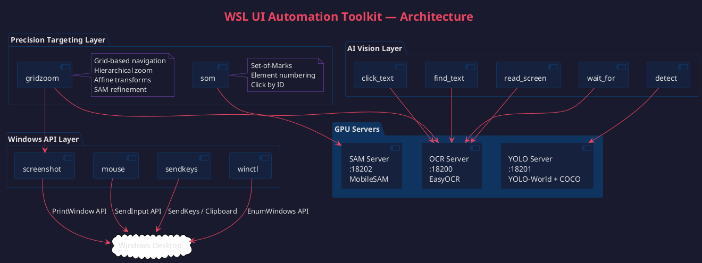
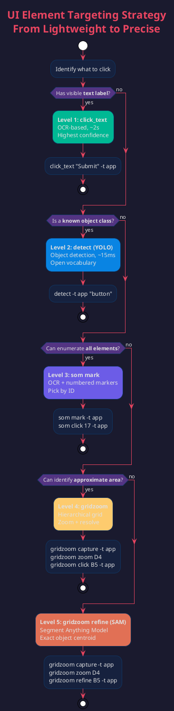
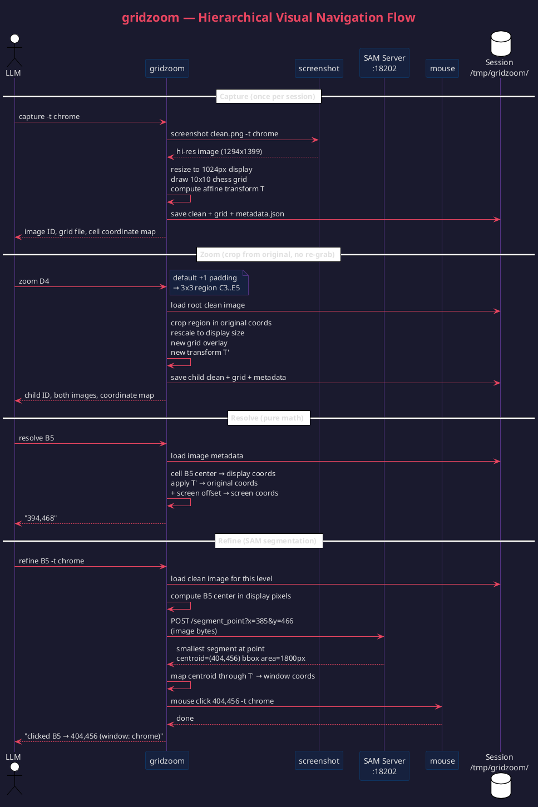
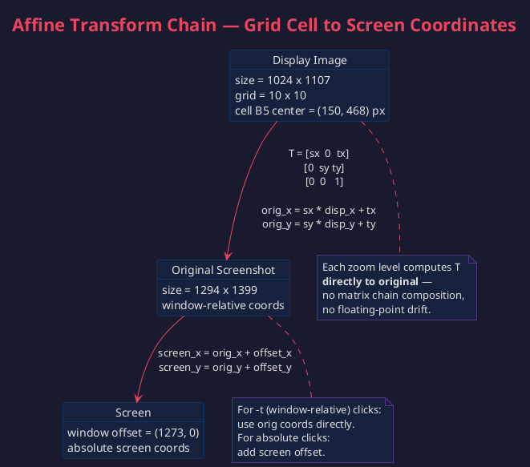

# WSL UI Automation Toolkit

A comprehensive GUI automation toolkit for Windows applications from WSL2. Combines low-level input tools (screenshot, mouse, keyboard) with AI-powered vision (OCR, YOLO, SAM) and precision targeting (grid navigation, Set-of-Marks) for intelligent UI interaction.

## Architecture



Three layers, each building on the one below:

| Layer | Tools | Purpose |
|-------|-------|---------|
| **Precision Targeting** | `gridzoom`, `som` | Hierarchical grid navigation, element numbering, SAM refinement |
| **AI Vision** | `click_text`, `find_text`, `detect`, `read_screen`, `wait_for` | OCR text interaction, YOLO object detection |
| **Windows API** | `screenshot`, `mouse`, `sendkeys`, `winctl` | Direct capture, input, and window management |

### GPU Servers

Three persistent servers eliminate model loading overhead:

```bash
find_text --start              # OCR server :18200 (EasyOCR, ~1.5s/scan)
detect --start                 # YOLO server :18201 (YOLO-World + COCO, ~15ms/detect)
python3 ~/bin/sam_server.py &  # SAM server :18202 (MobileSAM, ~3s/segment)
```

## UI Element Targeting Strategy

The toolkit provides **five levels** of targeting precision, from lightweight to surgical. Always start at Level 1 and escalate only when needed.



### Level 1: click_text (OCR) — fastest, most reliable
For anything with a visible text label. One command, exact coordinates.
```bash
click_text "Submit" -t chrome              # ~2s, pixel-perfect
click_text "Username" -t chrome --offset 200,0  # click input right of label
```

### Level 2: detect (YOLO) — object detection
For visual objects without text labels. Open vocabulary — describe what you see.
```bash
detect -t chrome "button,icon"             # ~15ms
detect -t chrome --coco                    # 80 fixed COCO classes
```

### Level 3: som (Set-of-Marks) — enumerate all elements
When you need to see everything at once. OCR detects all text elements, numbers them, you pick by ID.
```bash
som mark -t chrome                         # detect + annotate + list
som click 17 -t chrome                     # click marker #17
```

### Level 4: gridzoom (Grid Navigation) — hierarchical precision
For elements that OCR/YOLO can't detect. Single capture, pure image manipulation zooms, chess-style coordinates.
```bash
gridzoom capture -t chrome                 # one hi-res grab
gridzoom zoom D4                           # 3x3 crop around D4
gridzoom click B5 -t chrome                # resolve + click
```

### Level 5: gridzoom refine (SAM) — segment-level precision
Last resort for tiny or ambiguous targets. SAM finds the exact object boundary at your grid cell and returns the centroid.
```bash
gridzoom refine B5 -t chrome               # SAM segment → exact centroid → click
```

## gridzoom — Hierarchical Visual Navigation



### Core Concept

1. **One capture** — take a single hi-res screenshot of the window
2. **Zoom via image manipulation** — all subsequent "zooms" are crops of the original image (no re-grab)
3. **Chess-style grid** — each image gets an NxN grid with labels (A1, B5, etc.)
4. **Affine transforms** — the tool tracks scale + offset at each level, maps grid cells back to screen pixels
5. **SAM refinement** — when grid cell centers don't align with element centers, SAM finds the actual object

### Coordinate Transform



Each zoom level computes its transform **directly to the original** image — no matrix chain composition, no floating-point drift. Verified to 1px accuracy against OCR ground truth.

### Commands

```bash
gridzoom capture [-t TITLE]       # capture window, overlay 10x10 grid
gridzoom zoom [ID] CELL[+N]      # zoom: CELL+1 = 3x3, CELL+2 = 5x5, CELL+0 = single cell
gridzoom resolve [ID] CELL        # print screen coordinates for cell center
gridzoom click [ID] CELL [-t T]   # resolve + mouse click
gridzoom refine [ID] CELL [-t T]  # SAM segment → centroid → click
gridzoom clean                    # remove session files
```

### Output

Every command produces:
- **Grid image** — with labeled circular markers for cell reference
- **Clean image** — without overlay, for visual inspection
- **Coordinate map** — text table of all cell centers in window coordinates
- **JSON metadata** — affine transform, grid params, parent linkage

### Zoom Padding

`+N` controls how much context around the target cell:
- `D4+0` — just the single cell (1/100 of image) — pinpoint
- `D4` or `D4+1` — 3x3 window (9/100) — **default, recommended**
- `D4+2` — 5x5 window (25/100) — wide context
- `D4+3` — 7x7 window (49/100) — very wide

## Setup

### Prerequisites
- WSL2 with GPU passthrough (NVIDIA)
- Python 3.10+ with `ultralytics`, `easyocr`, `torch`, `Pillow`
- PowerShell (Windows side, called from WSL)

### Installation

```bash
# Copy tools to ~/bin/ (must be in PATH)
cp bin/* ~/bin/

# Install Python dependencies
pip install ultralytics easyocr torch torchvision opencv-python Pillow

# Copy Claude Code skills (optional, for slash commands)
cp skills/*.md ~/.claude/commands/
```

### Start GPU servers

```bash
find_text --start              # OCR server on :18200
detect --start                 # YOLO server on :18201
python3 ~/bin/sam_server.py &  # SAM server on :18202
```

## Tools Reference

### Low-level: Direct Windows API

| Tool | Purpose | Example |
|------|---------|---------|
| `screenshot` | Capture screen/window | `screenshot /tmp/s.png -t chrome` |
| `mouse` | Click, drag, scroll | `mouse click 500,300 -t chrome` |
| `sendkeys` | Type text, press keys | `sendkeys -t app "hello"` |
| `winctl` | Manage windows | `winctl focus chrome` |

### AI Vision: OCR-powered

| Tool | Purpose | Example |
|------|---------|---------|
| `click_text` | Find text + click | `click_text "Submit" -t chrome` |
| `find_text` | Find text position | `find_text "Search" -t chrome` |
| `wait_for` | Wait for text appear/disappear | `wait_for "Done" -t chrome` |
| `read_screen` | OCR all text on screen | `read_screen -t chrome --text-only` |

### AI Vision: YOLO-powered

| Tool | Purpose | Example |
|------|---------|---------|
| `detect` | Find objects by class name | `detect -t chrome "chair,car"` |
| `detect --coco` | Detect 80 COCO classes | `detect -t chrome --coco` |

### Precision Targeting

| Tool | Purpose | Example |
|------|---------|---------|
| `som mark` | Detect + number all elements | `som mark -t chrome` |
| `som click N` | Click element by number | `som click 17 -t chrome` |
| `gridzoom capture` | Start grid navigation session | `gridzoom capture -t chrome` |
| `gridzoom zoom` | Hierarchical zoom into area | `gridzoom zoom D4` |
| `gridzoom click` | Grid-precise click | `gridzoom click B5 -t chrome` |
| `gridzoom refine` | SAM-refined click | `gridzoom refine B5 -t chrome` |

## Performance

With GPU servers running (RTX 4080):

| Operation | Time | Server |
|-----------|------|--------|
| Screenshot capture | ~0.3s | — |
| **YOLO detection** | **~15ms** | :18201 |
| OCR scan | ~1.5s | :18200 |
| `click_text` end-to-end | ~2s | :18200 |
| `som mark` (full page) | ~2s | :18200 |
| `gridzoom capture + zoom` | ~1s | — |
| `gridzoom refine` (SAM) | ~3s | :18202 |

## Claude Code Integration

The `skills/` directory contains Claude Code slash commands:
- `/ui` — unified reference for all tools (updated with gridzoom/som)
- `/screenshot`, `/mouse`, `/sendkeys`, `/winctl` — individual tool skills

Copy to `~/.claude/commands/` to enable.

## Design Decisions

- **Layered targeting strategy**: Start with the simplest tool that works (click_text), escalate only when needed. Each level adds power at the cost of complexity.
- **Single capture, image-only zooms**: gridzoom takes one screenshot and derives all zooms via cropping — no quality loss, no re-grabs, deterministic transforms.
- **Direct-to-original transforms**: Each zoom level computes its affine transform directly to the root image, avoiding floating-point accumulation across chain compositions.
- **SAM as last resort**: MobileSAM segments the actual object boundary when grid cell centers don't align with element centers. Returns the segment centroid — pixel-perfect targeting on any shape.
- **Persistent GPU servers**: Three servers (OCR, YOLO, SAM) stay warm on the GPU. First query pays the model load cost; subsequent queries are fast.
- **Window-relative coordinates**: `--title` flag on all tools makes coordinates independent of window position. PrintWindow API captures even occluded windows.
